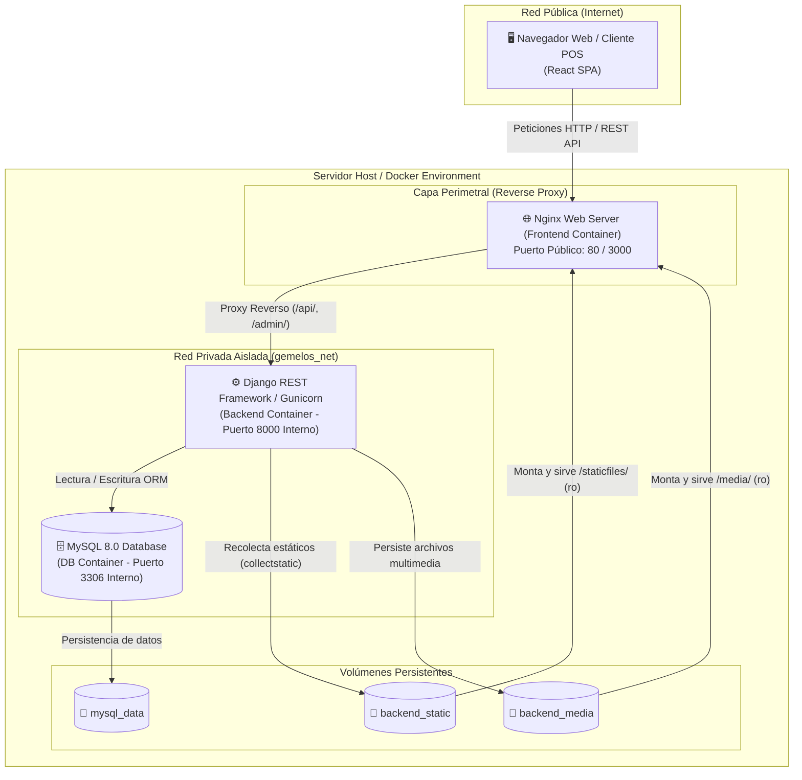

<div align="center">

# ☕ Gemelos Coffee POS & Inventory Management System

**Sistema integral de Punto de Venta, Control de Inventario en Tiempo Real (Kardex) y Reportería Financiera.**

[](https://reactjs.org/)
[](https://www.djangoproject.com/)
[](https://www.mysql.com/)
[](https://www.docker.com/)
[](https://tailwindcss.com/)
[](LICENSE)

<br />

[English](README.md) | **Español**

</div>

---

## 📌 Descripción General

**Gemelos Coffee POS** es una plataforma web modular diseñada para optimizar las operaciones de punto de venta, control estricto de existencias mediante Kardex ponderado, facturación multicanal y análisis de rentabilidad en tiempo real. 

Construido con una arquitectura desacoplada y contenerizada, el sistema garantiza alta disponibilidad, aislamiento de seguridad por capas y una experiencia de usuario fluida y reactiva.

---

## 🏗️ Arquitectura del Sistema

El sistema implementa un diseño de microservicios contenerizado mediante **Docker Compose**, donde únicamente el servidor web perimetral (**Nginx**) expone el puerto público HTTP, manteniendo la API Django y el motor MySQL en una subred interna privada.



---

## ✨ Características Principales

### 🛒 1. Terminal Punto de Venta (POS)
* **Carrito y Facturación en Tiempo Real:** Búsqueda rápida de productos con autocompletado, soporte para lectores de código y gestión de cantidades con cálculo dinámico de subtotales e impuestos.
* **Múltiples Métodos de Pago:** Registro de transacciones en Efectivo, Tarjeta y Transferencia bancaria.
* **Separación de Ítems:** Distinción operativa entre **Productos de Reventa** (con control de inventario) y **Servicios / Preparados** (sin deducción física).

### 📦 2. Kardex e Inventario Ponderado
* **Trazabilidad Total:** Registro inmutable de transacciones clasificadas por `SALE` (Venta POS), `RESTOCK` (Reabastecimiento), `ADJUSTMENT` (Ajustes manuales) e `INITIAL` (Inventario inicial).
* **Costeo CPP:** Seguimiento del Costo Promedio Ponderado para el cálculo exacto de la utilidad bruta por producto y por lote.
* **Alertas de Stock:** Indicadores de existencias críticas y prevención de ventas sin disponibilidad física.

### 📊 3. Analítica y Reportes Financieros
* **Dashboard Interactivo:** Métricas clave de ingresos, volumen de ventas y gráficos de rendimiento con **Recharts**.
* **Exportación de Reportes:** Generación automática de balances y reportes de inventario en formatos **PDF** (con diseño formal) y **Excel (XLSX)**.

### 🔐 4. Seguridad y Control de Acceso (RBAC)
* **Autenticación JWT:** Tokens de acceso de corta duración y refresh tokens con persistencia controlada.
* **Roles de Usuario:** Segmentación de permisos entre Administrador (gestión total, costos, kardex, reportes) y Cajero/Personal de Ventas (terminal POS).

---

## 🛠️ Stack Tecnológico

| Capa / Componente | Tecnología | Descripción |
| :--- | :--- | :--- |
| **Frontend** | React 18 + TailwindCSS | SPA reactiva con React Router DOM 7, Lucide Icons y Context API |
| **Visualización / Reportes** | Recharts, jsPDF, XLSX | Gráficas dinámicas y exportación de documentos cliente/servidor |
| **Backend** | Python 3.12 + Django 5.1 | Django REST Framework (DRF), Gunicorn y PyMySQL |
| **Base de Datos** | MySQL 8.0 | Motor relacional con integridad transaccional y claves foráneas |
| **Infraestructura / DevOps** | Docker & Docker Compose | Contenedores optimizados con Nginx como Reverse Proxy |

---

## 📁 Estructura del Repositorio

```text
├── app/
│   ├── backend/                # API REST Django
│   │   ├── inventory/          # Modelos (Product, Sale, StockMovement), vistas y serializers
│   │   ├── pos_system/         # Configuración global, URLs, WSGI y settings
│   │   ├── Dockerfile          # Imagen backend optimizada
│   │   └── requirements.txt    # Dependencias Python
│   └── frontend/               # Aplicación React SPA
│       ├── public/             # Assets estáticos y favicons
│       ├── src/                # Componentes, vistas (Kardex, Sales, Reports) y contextos
│       ├── nginx.conf          # Configuración de Nginx y proxy reverso
│       ├── Dockerfile          # Multi-stage build para producción
│       └── package.json        # Dependencias de Node.js
├── docker-compose.yml          # Orquestación de servicios (db, backend, frontend)
├── .env.example                # Plantilla de variables de entorno globales
├── LICENSE                     # Licencia de código abierto MIT
├── README.md                   # Documentación en inglés (principal)
└── README.es.md                # Documentación en español
```

---

## ⚙️ Variables de Entorno

El proyecto incluye plantillas listas para configurar:

1. **Raíz ([`.env.example`](.env.example)):** Controla la configuración global de Docker Compose, MySQL y Django:
   ```env
   DEBUG=False
   SECRET_KEY=tu-clave-secreta-de-django
   ALLOWED_HOSTS=127.0.0.1,localhost,gemelos_backend
   CSRF_TRUSTED_ORIGINS=http://127.0.0.1,http://localhost
   CORS_ALLOWED_ORIGINS=http://localhost:3000,http://127.0.0.1:3000

   DATABASE=mysql
   SQL_DATABASE=pos_database
   SQL_USER=pos_user
   SQL_PASSWORD=tu_password_segura
   SQL_ROOT_PASSWORD=tu_root_password_segura
   ```

2. **Frontend ([`app/frontend/.env.example`](app/frontend/.env.example)):** Controla los endpoints de consumo de API:
   ```env
   REACT_APP_API_BASE_URL=http://localhost:8000/api
   REACT_APP_MEDIA_BASE_URL=http://localhost:8000
   ```

---

## 🚀 Guía de Despliegue Local Rápido (Quickstart)

### 1. Clonar el Repositorio y Configurar Variables
```bash
git clone https://github.com/Zan280/pos-gemelos-coffee.git
cd pos-gemelos-coffee

# Crear archivo .env a partir de la plantilla
cp .env.example .env
```

### 2. Construir e Iniciar los Contenedores
```bash
docker compose up --build -d
```

### 3. Crear el Usuario Administrador (Superuser)
```bash
docker compose exec backend python manage.py createsuperuser
```

### 4. Acceso a las Plataformas
* 💻 **Terminal POS & Frontend:** [http://localhost:80](http://localhost:80) (o el puerto asignado a Nginx)
* ⚙️ **Panel Administrativo Django:** [http://localhost:80/admin](http://localhost:80/admin)
* 🔌 **API REST Endpoints:** `http://localhost:80/api/`

---

## 📄 Licencia

Este proyecto se distribuye bajo la licencia **MIT**. Consulta el archivo [`LICENSE`](LICENSE) para obtener más información.

---

<div align="center">
### 🎓 Contexto Académico
Este software fue diseñado, desarrollado y defendido como proyecto de **Seminario de Graduación** en la **Universidad Nacional Autónoma de Nicaragua, Managua (UNAN-Managua)** para optar al título profesional en Ingeniería Electrónica.

El sistema resuelve necesidades reales de facturación, kardex y gestión operativa para **Gemelos Coffee**, implementado bajo una arquitectura web moderna basada en contenedores.
</div>
