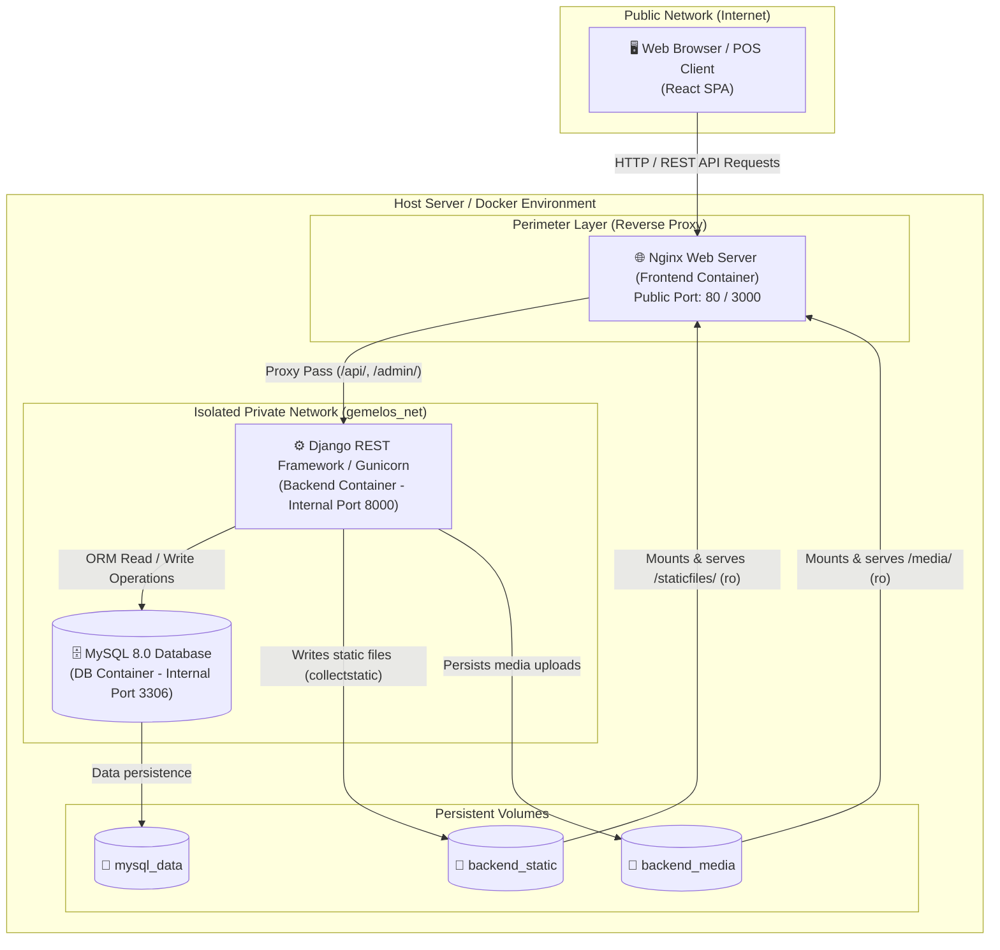

<div align="center">

# ☕ Gemelos Coffee POS & Inventory Management System

**Comprehensive Point of Sale (POS), Real-Time Inventory Control (Kardex), and Financial Reporting Platform.**

[](https://reactjs.org/)
[](https://www.djangoproject.com/)
[](https://www.mysql.com/)
[](https://www.docker.com/)
[](https://tailwindcss.com/)
[](LICENSE)

<br />

**English** | [Español](README.es.md)

</div>

---

## 📌 Overview

**Gemelos Coffee POS** is a modular web application engineered to streamline retail and food-service operations. It combines a fast, intuitive point-of-sale checkout with rigorous inventory tracking (Weighted Average Cost / Kardex ledger), multi-channel billing, and real-time financial profitability analytics.

Built with a decoupled, containerized architecture, the platform provides high availability, multi-tier security isolation, and a responsive user experience.

---

## 🏗️ System Architecture

The application is deployed as a microservices architecture managed with **Docker Compose**. Only the perimeter web server (**Nginx**) exposes a public HTTP port, securely isolating both the Django REST Framework backend and the MySQL database inside a dedicated private Docker network.



---

## ✨ Key Features

### 🛒 1. Point of Sale (POS) Terminal
* **Real-Time Cart & Checkout:** Fast item search with auto-completion, barcode scanner integration, dynamic quantity adjustments, and automatic calculation of subtotal, taxes, and change.
* **Flexible Payment Methods:** Seamless processing for Cash, Credit/Debit Cards, and Bank Transfers.
* **Item Classification:** Clear operational distinction between **Inventory Products** (with automated stock deduction) and **Services / Made-to-Order Items** (non-inventory).

### 📦 2. Kardex Ledger & Inventory Tracking
* **Full Audit Trail:** Immutable ledger of inventory transactions categorized by `SALE` (POS checkout), `RESTOCK` (Purchases/Inflows), `ADJUSTMENT` (Manual reconciliations), and `INITIAL` (Opening balance).
* **Weighted Average Cost (WAC / CPP):** Accurate calculation of product acquisition costs and gross profit margins on every transaction.
* **Low-Stock Warnings:** Real-time stock visibility with safeguards against overselling out-of-stock items.

### 📊 3. Analytics & Financial Reporting
* **Interactive Dashboard:** Core operational metrics, daily/monthly revenue trends, and visual performance charts powered by **Recharts**.
* **Document Export:** Instant generation and export of formal inventory and sales reports in **PDF** (custom formatted layout) and **Excel (XLSX)**.

### 🔐 4. Security & Role-Based Access Control (RBAC)
* **JWT Authentication:** Short-lived access tokens and secure refresh token handling.
* **Role Hierarchies:** Granular permissions distinguishing between Administrators (full access to costs, Kardex, reports, and system settings) and Cashiers (POS checkout access).

---

## 🛠️ Tech Stack

| Layer / Component | Technology | Description |
| :--- | :--- | :--- |
| **Frontend** | React 18 + TailwindCSS | Responsive SPA built with React Router DOM 7, Lucide Icons, and Context API |
| **Visualization & Reports** | Recharts, jsPDF, XLSX | Dynamic charts and client/server-side document export |
| **Backend** | Python 3.12 + Django 5.1 | Django REST Framework (DRF), Gunicorn WSGI server, and PyMySQL |
| **Database** | MySQL 8.0 | Relational database with full foreign-key constraints and ACID transaction guarantees |
| **DevOps & Infrastructure** | Docker & Docker Compose | Containerized multi-service setup featuring Nginx as a hardened reverse proxy |

---

## 📁 Repository Structure

```text
├── app/
│   ├── backend/                # Django REST API
│   │   ├── inventory/          # Models (Product, Sale, StockMovement), views, and serializers
│   │   ├── pos_system/         # Core settings, URL routing, and WSGI entry point
│   │   ├── Dockerfile          # Production backend image
│   │   └── requirements.txt    # Python dependencies
│   └── frontend/               # React SPA client
│       ├── public/             # Static assets and favicons
│       ├── src/                # Components, pages (Kardex, Sales, Reports), and context providers
│       ├── nginx.conf          # Nginx reverse proxy configuration
│       ├── Dockerfile          # Multi-stage production build
│       └── package.json        # Node.js dependencies
├── docker-compose.yml          # Service orchestration (db, backend, frontend)
├── .env.example                # Global environment variables template
├── LICENSE                     # MIT Open Source License
├── README.md                   # English documentation (default)
└── README.es.md                # Spanish documentation
```

---

## ⚙️ Environment Variables

The repository includes pre-configured environment templates:

1. **Root ([`.env.example`](.env.example)):** Controls global Docker Compose, MySQL, and Django backend configuration:
   ```env
   DEBUG=False
   SECRET_KEY=your-secure-django-secret-key
   ALLOWED_HOSTS=127.0.0.1,localhost,gemelos_backend
   CSRF_TRUSTED_ORIGINS=http://127.0.0.1,http://localhost
   CORS_ALLOWED_ORIGINS=http://localhost:3000,http://127.0.0.1:3000

   DATABASE=mysql
   SQL_DATABASE=pos_database
   SQL_USER=pos_user
   SQL_PASSWORD=your_secure_user_password
   SQL_ROOT_PASSWORD=your_secure_root_password
   ```

2. **Frontend ([`app/frontend/.env.example`](app/frontend/.env.example)):** Configures API consumption endpoints:
   ```env
   REACT_APP_API_BASE_URL=http://localhost:8000/api
   REACT_APP_MEDIA_BASE_URL=http://localhost:8000
   ```

---

## 🚀 Quickstart Guide (Local Deployment)

### 1. Clone the Repository & Configure Environment
```bash
git clone https://github.com/Zan280/pos-gemelos-coffee.git
cd pos-gemelos-coffee

# Create .env from the template
cp .env.example .env
```

### 2. Build & Launch Containers
```bash
docker compose up --build -d
```

### 3. Create an Administrative Superuser
```bash
docker compose exec backend python manage.py createsuperuser
```

### 4. Access the Applications
* 💻 **POS Terminal & Web Frontend:** [http://localhost:80](http://localhost:80) (or your configured Nginx port)
* ⚙️ **Django Administration Panel:** [http://localhost:80/admin](http://localhost:80/admin)
* 🔌 **REST API Endpoints:** `http://localhost:80/api/`

---

## 📄 License

This project is licensed under the **MIT License**. See the [`LICENSE`](LICENSE) file for details.

---

<div align="center">
### 🎓 Academic Context
This software was designed, developed, and defended as a **Graduation Seminar Capstone Project** at the **National Autonomous University of Nicaragua, Managua (UNAN-Managua)** to earn the degree in Electronic Engineering. 

The project addresses real-world inventory, billing, and operational management needs for **Gemelos Coffee**, engineered from the ground up using a modern containerized web architecture.
</div>
